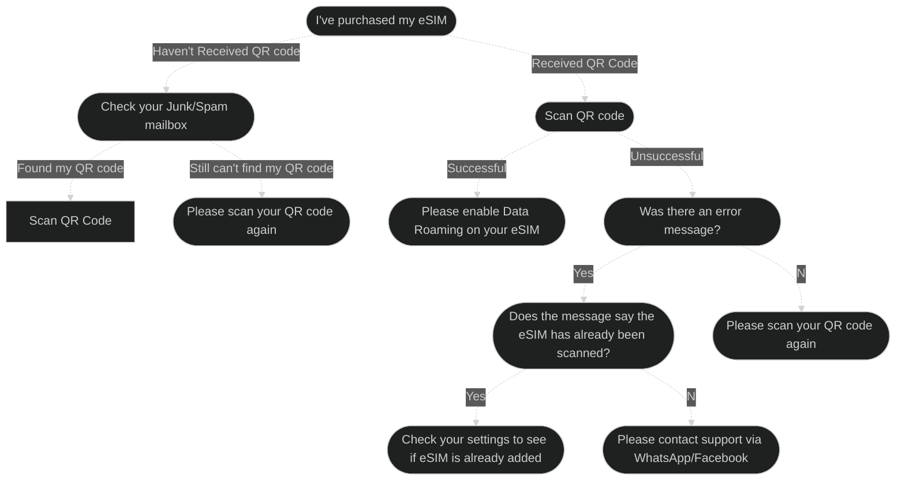
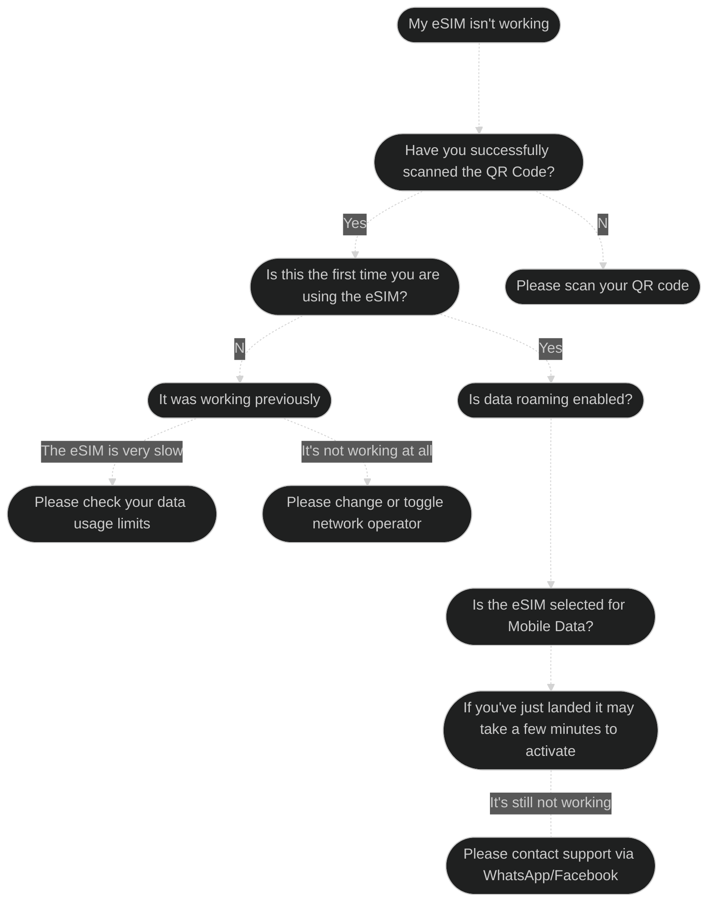

# South Korea eSIM
{: .no_toc }
[Purchase Now](https://www.northsim.com/product/south-korea-travel-esim/){: .btn .btn-yellow-300}

### eSIM Details
{: .no_toc }

| Coverage       | Network                     | APN      |
|----------------|-----------------------------|----------|
| South Korea    | KT, SKT                     | internet |

Thank you for purchasing your eSIM from NorthSIM. Activating your eSIM is a straightforward process. All you need to do is connect to WiFi and follow the steps for your device.

## Table of contents
{: .no_toc .text-delta }

1. TOC
{:toc}

## eSIM Activation Checklist

1. Connect to WiFi
2. Scan your QR code
3. Enable Data Roaming
4. Select your eSIM for Mobile Data

## Activating your eSIM

- You should activate your eSIM the day before you fly. 
- All our eSIMs must be activated within 30 days of purchase.
- For iPhone/iOS and most Android devices please use the default camera app to scan your QR code. If this doesn't work please follow the steps below.
- For Pixel devices please follow the steps below

  

    For Apple iPhone and iOS Devices
  

{: .highlight }
Go to Settings > Mobile (Cellular)

{:width="40%"}

{: .highlight }
Then tap on add an eSIM

{:width="40%"}

{: .highlight }
Choose the use QR Code option

{:width="40%"}

{: .highlight }
Scan your QR Code (or enter your QR details manually if you have been given them)

{:width="40%"}

  

    For Samsung Galaxy/Android Devices
  

{: .highlight }
Go to Settings > Connections

{:width="40%"}

{: .highlight }
Then tap on SIM Card Manager

{:width="40%"}

{: .highlight }
Tap on Add Mobile Plan

{:width="40%"}

{: .highlight }
Tap on Scan Carrier QR Code

{:width="40%"}

{: .highlight }
Scan your QR Code (or enter your QR details manually if you have been given them)

{:width="40%"}

  

    For Google Pixel/Android Devices
  

{: .highlight }
- Go to Settings > Network & Internet
- Look for the SIMs menu and click the + button
- Tap on Download a SIM instead
- Tap Next and follow the instructions
- Scan your QR code

## Enabling Data Roaming

Now that you've successfully acitvated your eSIM, it's time to turn on Data Roaming.

  

    For Apple iPhone and iOS Devices
  

{: .highlight }
- Go to Settings
- Tap on Mobile
- Tap on the eSIM
- Scroll down and toggle on Data Roaming

  

    For Samsung Galaxy/Android Devices
  

{: .highlight }
- Go To Settings
- Tap on Connections
- Tap on Mobile Networks
- Toggle on Data Roaming

  

    For Google Pixel/Android Devices
  

{: .highlight }
- Go to Settings
- Tap on Network & Internet
- Tap on Internet
- Tap on the eSIM's setting icon (it looks like a gear)
- Toggle Roaming on

## Checking Data Usage

Unless otherwise stated all NorthSIM eSIMs will throttle to 128kbps after your data limit has been reached. You are welcome to use thrid party data usage tracking apps to track your data usage. Alternatively your device will have an inbuilt data usage counter.

  

    For Apple iPhone and iOS Devices
  

  {: .highlight }
- Go to Settings
- Tap on Mobile
- Scroll down and check the Data Roaming Usage value

  

    For Samsung Galaxy/Android Devices
  

{: .highlight }
- Go To Settings
- Tap on Connections
- Tap on Data Usage
- Check the data usage for your eSIM

  

    For Google Pixel/Android Devices
  

  {: .highlight }
- Go to Settings
- Tap on Network & Internet
- Tap on Internet
- Tap on the eSIM you have installed
- Check your data usage

## Troubleshooting

### Toggling and Reseting the Network Operator
If you're eSIM has suddenly stopped working it might be due to your phone's network operator settings. Our eSIMs roam across multiple networks to provide the best coverage, and sometimes roaming between networks can cause issues on yout device. To toggle/reset the network operator please follow the below instructions for your device:

  

    For Apple iPhone and iOS Devices
  

{: .highlight }

- On North American iPhone Mobile is also known as Cellular
- Go to Settings
- Tap on Mobile or Mobile Data
- Tap on Network Selection
- Toggle on and then off Automatic

  

    For Samsung Galaxy/Android Devices
  

{: .highlight }
- Go To Settings
- Tap on Connections
- Tap on Mobile Networks
- Tap on Network Operators
- Toggle off and then on Select Automatically

  

    For Google Pixel/Android Devices
  

{: .highlight }
- Go to Settings
- Tap on Network & Internet
- Tap on your eSIM
- Tap on Advanced
- Toggle off and then on Automatically Select Network

### Checking APN Settings

NorthSIM eSIMs automatically download APN configurations at the time of eSIM installtion. However sometimes the APN download process can be interupted and as a result the APN may not be configured correctly. To ensure your APN settings are correct please check that the APN Name matches the APN in the eSIM details section above.

  

    For Apple iPhone and iOS Devices
  

{: .highlight }

- Settings > Mobile > Mobile Data Network
- Settings > Mobile Data > Mobile Data Options > Mobile Data Network
- Ensure that the APN Name is set as per eSIM details section above

  

    For Samsung Galaxy/Android Devices
  

{: .highlight }
- Go To Settings
- Tap on Connections
- Tap on Mobile Networks
- Tap on Access Point Names
- Ensure that the APN Name is set as per eSIM details section above

  

    For Google Pixel/Android Devices
  

{: .highlight }
- Go to Settings
- Tap on Network & Internet
- Tap on your eSIM
- Tap on Advanced
- Tap on Access Point Names
- Ensure that the APN Name is set as per eSIM details section above

### Common eSIM issues

  

    eSIM Activation Issues
  

Most eSIM activation issues can be easily resolved by following the below steps:

  

    My eSIM doesn't work (or stopped working)
  

Most eSIM issues can be resolved easily by following the below steps:

